# 📊 SmartPOS Processing Flow Analysis (Luồng Xử Lý)

## 🎯 System Overview

SmartPOS là hệ thống quản lý thanh toán và hóa đơn gồm 3 module độc lập nhưng có liên kết:

| Module | Port | Chức Năng |
|--------|------|----------|
| **VNPay** | 8081 | Xử lý thanh toán qua VNPay gateway |
| **Invoice** | 8082 | Quản lý tạo và xuất hóa đơn PDF |
| **Print** | 8083 | Quản lý hàng đợi in ấn |

---

## 🔄 Complete End-to-End Processing Flow

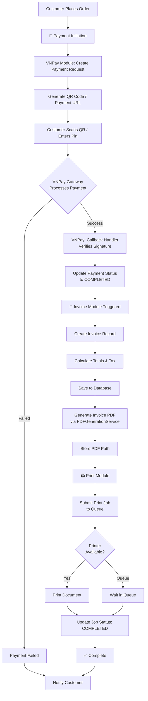

---

## 📦 Module 1: VNPay Payment Processing

### 1.1 Payment Creation Flow

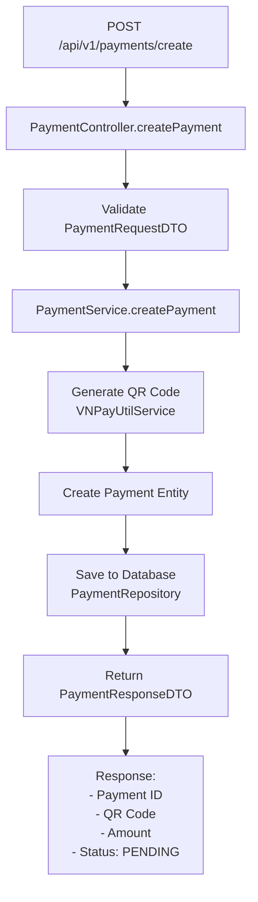

### 1.2 Callback Handler Flow (Critical)

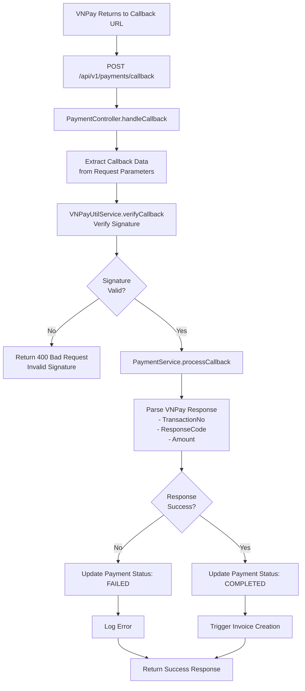

### 1.3 Payment States (Trạng Thái Thanh Toán)

```
┌─────────────────────────────────────────────────┐
│         Payment Status Transitions               │
├─────────────────────────────────────────────────┤
│ PENDING ──> (VNPay Processing)                  │
│      ├──> SUCCESS ──> (Invoice Creation)        │
│      ├──> FAILED ──> (Retry or Cancel)          │
│      └──> EXPIRED ──> (Timeout after 24h)       │
└─────────────────────────────────────────────────┘
```

---

## 📄 Module 2: Invoice Processing

### 2.1 Invoice Creation Flow

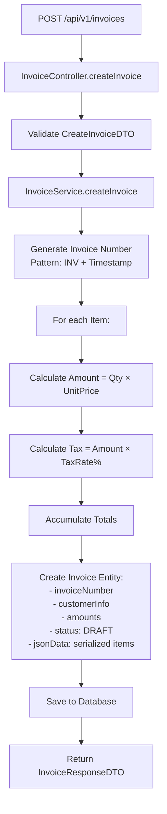

### 2.2 Invoice State Machine

```
┌────────────────────────────────────────────────────┐
│      Invoice Lifecycle                             │
├────────────────────────────────────────────────────┤
│ DRAFT ──> (POST /issue) ──> ISSUED                │
│           │                   │                    │
│           │                   └──> (POST /generate-pdf)
│           │                        │                │
│           │                        └──> PDF Created │
│           │                              │          │
│           │                              └──> READY_TO_PRINT
│           │                                        │
│           └──> (Can edit items, amounts, etc)      │
│                                                     │
│ ISSUED ──> (Payment confirmed) ──> PAID           │
└────────────────────────────────────────────────────┘
```

### 2.3 PDF Generation Flow

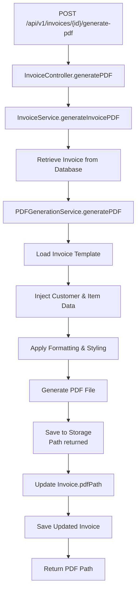

### 2.4 PDF Retrieval Flow

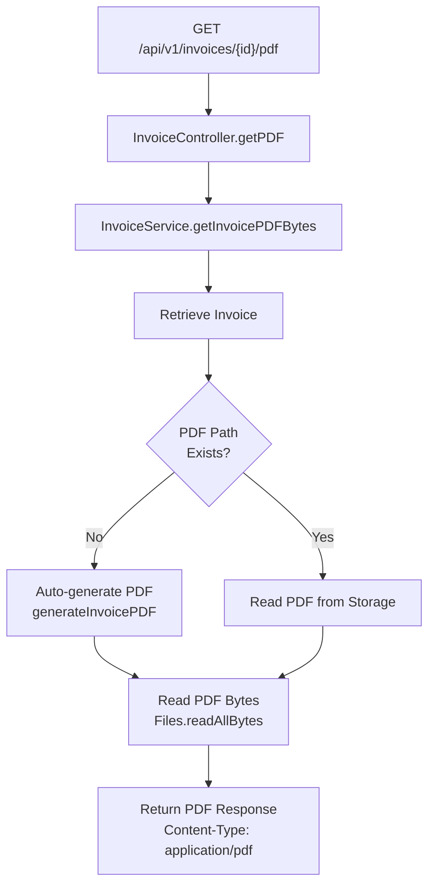

### 2.5 Invoice Data Model

```
Invoice Entity
├── id (PK)
├── invoiceNumber (UNIQUE) - INV1234567890123
├── customerName
├── customerPhone
├── customerEmail
├── customerAddress
├── totalAmount (Tính từ items)
├── taxAmount (Accumulated taxes)
├── grandTotal (totalAmount + taxAmount)
├── status (DRAFT, ISSUED, PAID)
├── createdAt
├── issuedAt (Set when ISSUED)
├── paidAt (Set when PAID)
├── notes
├── pdfPath (File system path)
└── jsonData (Serialized items for history)
```

---

## 🖨️ Module 3: Print Processing

### 3.1 Print Job Submission Flow

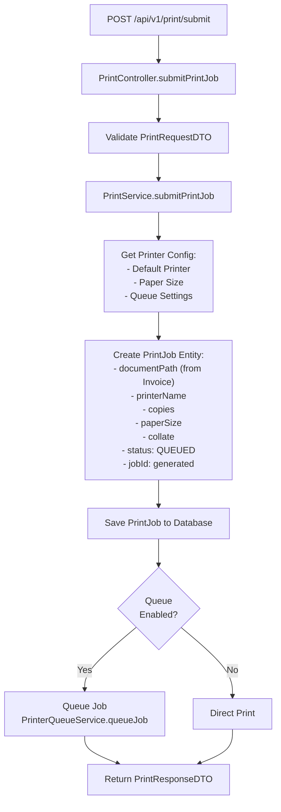

### 3.2 Print Job State Management

```
┌──────────────────────────────────────────────────┐
│      Print Job Lifecycle                         │
├──────────────────────────────────────────────────┤
│ QUEUED ──> (Printer ready) ──> PRINTING          │
│             │                    │                │
│             │                    └──> COMPLETED   │
│             │                                     │
│             └──> FAILED (Printer error)           │
│                       │                           │
│                       └──> Can RETRY              │
│                                                   │
│ Each job tracks: createdAt, completedAt, errorMsg
└──────────────────────────────────────────────────┘
```

### 3.3 Print Job Status Tracking

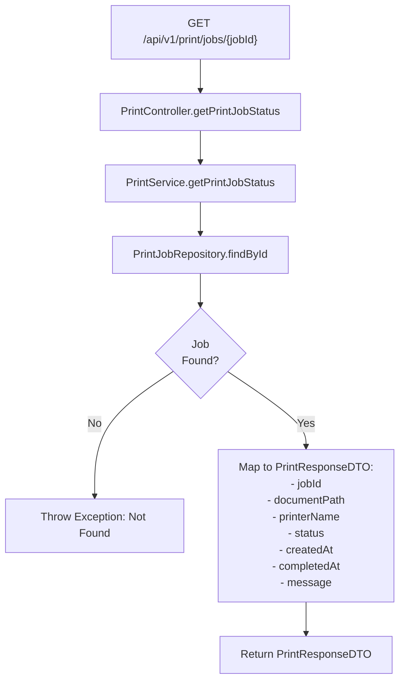

### 3.4 PrintJob Data Model

```
PrintJob Entity
├── id (PK)
├── jobId (Generated unique ID)
├── documentPath (from Invoice PDF)
├── printerName (Printer device name)
├── copies (1-100)
├── paperSize (A4, A3, etc)
├── collate (true/false)
├── status (QUEUED, PRINTING, COMPLETED, FAILED)
├── createdAt
├── completedAt
└── errorMessage (if FAILED)
```

---

## 🔗 Inter-Module Integration Flow

### Payment → Invoice Integration

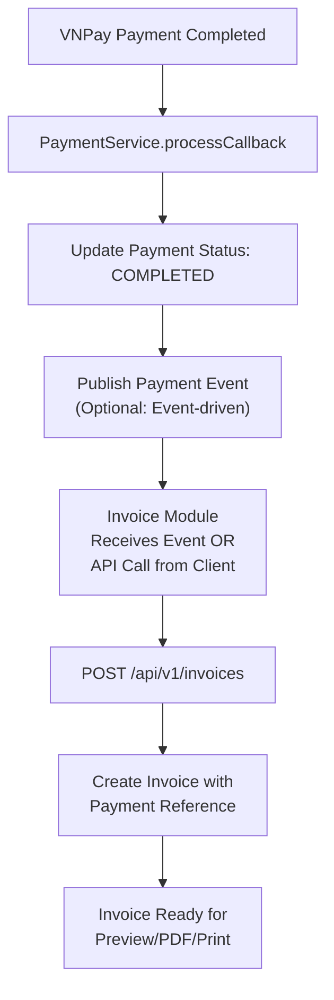

### Invoice → Print Integration

```
┌─────────────────────────────────────────────┐
│  Invoice Workflow → Print Workflow           │
├─────────────────────────────────────────────┤
│ 1. Create Invoice (DRAFT)                   │
│ 2. Issue Invoice (ISSUED)                   │
│ 3. Generate PDF (pdfPath created)           │
│ 4. Client calls Print API with PDF path     │
│ 5. Print Service queues job                 │
│ 6. Print module handles printing            │
│ 7. Return job status to client              │
└─────────────────────────────────────────────┘
```

---

## 📊 Complete System Data Flow Diagram

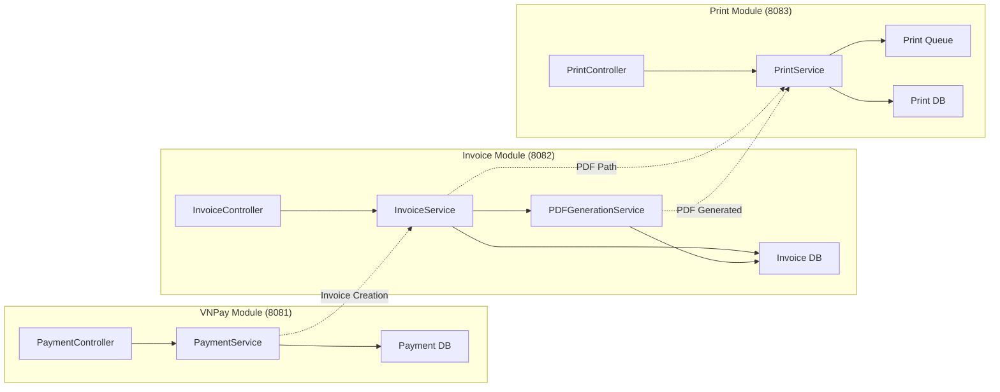

---

## 🎯 API Endpoint Summary

### VNPay Module (`/api/v1/payments`)
- `POST /create` - Tạo request thanh toán
- `GET /{id}` - Lấy thông tin thanh toán
- `POST /callback` - Webhook từ VNPay (CRITICAL)

### Invoice Module (`/api/v1/invoices`)
- `POST /` - Tạo hóa đơn mới (DRAFT)
- `GET /{id}` - Lấy thông tin hóa đơn
- `POST /{id}/issue` - Phát hành hóa đơn
- `POST /{id}/generate-pdf` - Tạo PDF
- `GET /{id}/pdf` - Tải PDF file

### Print Module (`/api/v1/print`)
- `POST /submit` - Gửi công việc in
- `GET /jobs/{jobId}` - Kiểm tra trạng thái in

---

## ⚠️ Key Processing Points (Điểm Quan Trọng)

### Critical Success Factors:

1. **VNPay Callback Verification**
   - ✅ Signature verification bắt buộc
   - ✅ Retry logic for failed payments
   - ✅ Idempotency check (prevent duplicate processing)

2. **Invoice Calculation**
   - ✅ Tax calculation accuracy per item
   - ✅ Grand total = sum of all items + taxes
   - ✅ JSON serialization for audit trail

3. **PDF Generation**
   - ✅ Auto-generate if not exists
   - ✅ Template validation
   - ✅ File storage path management

4. **Print Queue Management**
   - ✅ Job persistence in DB
   - ✅ Queue vs Direct print logic
   - ✅ Error handling for printer failures

---

## 📋 Processing Flow Sequence (Chi Tiết)

### Scenario: Customer buys items and prints invoice

```
Time  | VNPay        | Invoice      | Print        | Database
------|--------------|--------------|--------------|----------
t0    | PENDING      | -            | -            | Payment created
t1    | Customer     | -            | -            | -
      | scans QR     |              |              |
t2    | Processing   | -            | -            | -
t3    | COMPLETED    | -            | -            | Payment updated
t4    | -            | DRAFT        | -            | Invoice created
t5    | -            | ISSUED       | -            | Invoice issued
t6    | -            | Generating   | -            | -
      |              | PDF          |              |
t7    | -            | PDF ready    | -            | Invoice.pdfPath set
t8    | -            | -            | QUEUED       | PrintJob created
t9    | -            | -            | PRINTING     | PrintJob status updated
t10   | -            | -            | COMPLETED    | PrintJob completed
```

---

## 🔍 Error Handling Flows

### Payment Processing Error

```
POST /callback → Invalid Signature → Return 400
                                   → Log error
                                   → No DB update
                                   → Retry from client
```

### Invoice Creation Error

```
POST /invoices → Invalid items
             → Tax calculation overflow
             → Return 400 Bad Request
             → Invoice NOT created
             → Rollback transaction
```

### PDF Generation Error

```
POST /{id}/generate-pdf → Template not found
                        → Disk space exceeded
                        → Return 500 Internal Error
                        → Log stack trace
                        → Invoice pdfPath remains null
```

### Print Job Error

```
POST /submit → Printer offline
            → Queue full
            → Job created with status FAILED
            → Error message in DB
            → Client can retry
```

---

## 📈 Performance Considerations

| Component | Typical Response Time | Bottleneck |
|-----------|----------------------|------------|
| Payment Creation | 100-200ms | QR code generation |
| Invoice Creation | 50-100ms | DB insert |
| PDF Generation | 500-1000ms | Template rendering |
| Print Job Submit | 50-100ms | Queue service |
| Callback Processing | 20-50ms | Signature verification |

---

## ✅ Validation Checkpoints

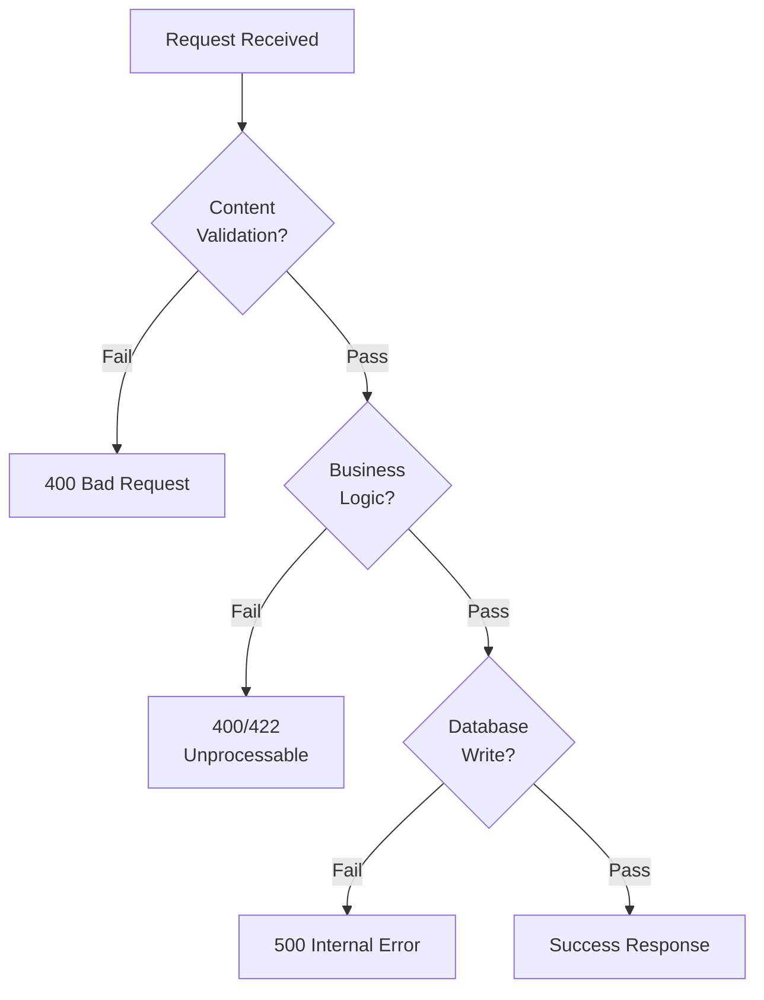

---

## 🎓 Recommended Testing Strategy

1. **Unit Tests**: Service methods with mocked dependencies
2. **Integration Tests**: Service → DB → Repository
3. **API Tests**: Controller → Service flow
4. **Callback Tests**: Mock VNPay responses (success/failure)
5. **End-to-End**: Full payment → invoice → print flow

---

## 📝 Next Implementation Steps

Based on the flow analysis:

1. ✅ Module Setup Complete
2. → Implement VNPay callback verification (most critical)
3. → Implement invoice calculation logic
4. → Implement PDF generation
5. → Implement print queue management
6. → Add comprehensive error handling
7. → Add idempotency checks
8. → Add audit logging
