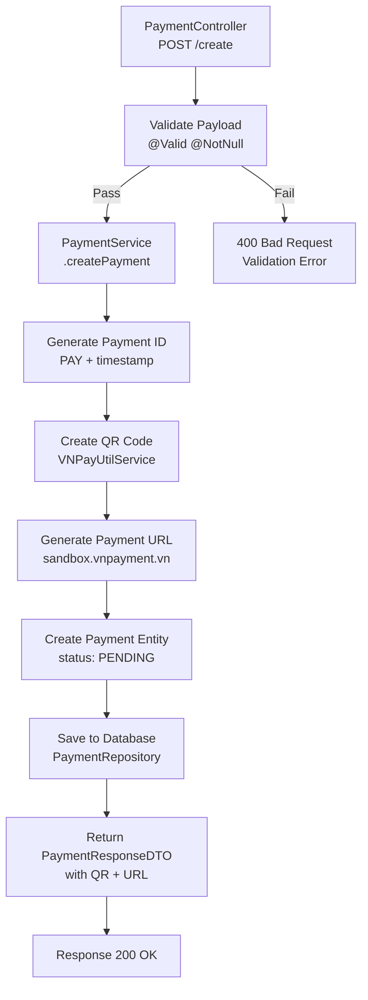
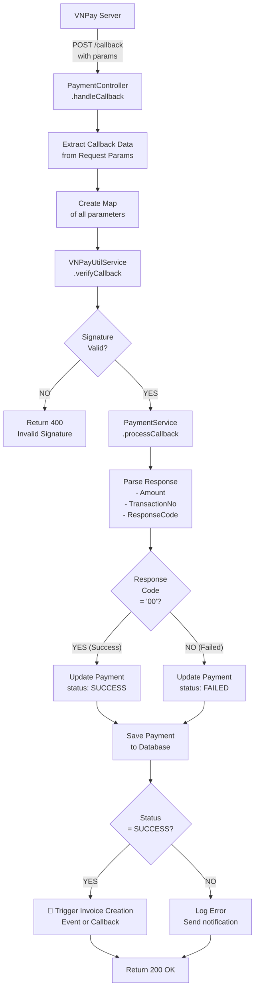
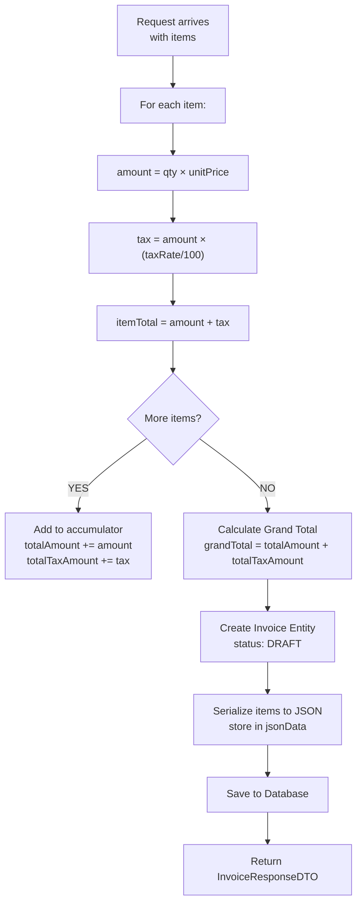
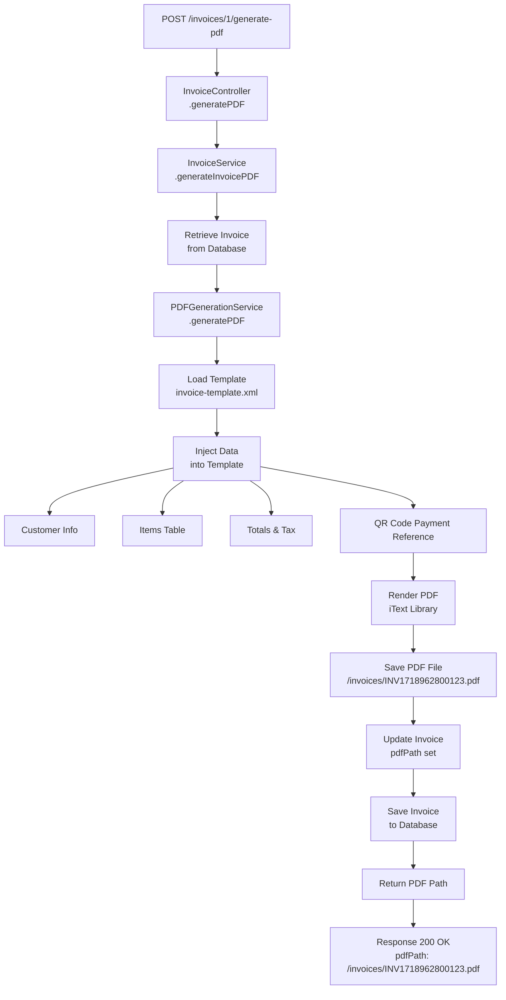
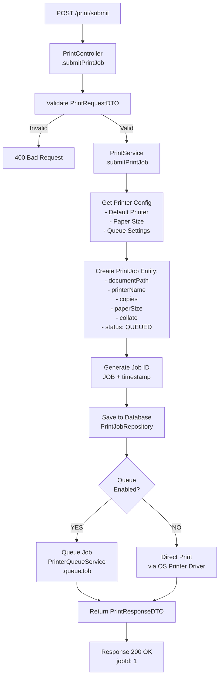

# 💳 Luồng Xử Lý: Thanh Toán QR → Hóa Đơn → In

## 🎯 Tổng Quan Quy Trình


---

## 📋 BƯỚC 1: Tạo Request Thanh Toán (QR Code)

### 1.1 API Endpoint
```
POST http://localhost:8081/api/v1/payments/create
```

### 1.2 Request Payload
```json
{
  "amount": 500000,
  "orderInfo": "Order #12345",
  "ipAddress": "192.168.1.100",
  "returnUrl": "http://localhost:3000/payment-success",
  "notifyUrl": "http://localhost:8081/api/v1/payments/callback"
}
```

### 1.3 PaymentRequestDTO
```java
@Data
@Builder
@Valid
public class PaymentRequestDTO {
    @NotNull(message = "Amount is required")
    @Positive(message = "Amount must be positive")
    private Long amount;
    
    @NotBlank(message = "Order info is required")
    private String orderInfo;
    
    @NotNull(message = "IP Address is required")
    private String ipAddress;
    
    private String returnUrl;
    private String notifyUrl;
}
```

### 1.4 Response Payload
```json
{
  "id": 1,
  "paymentId": "PAY-1718962800123",
  "amount": 500000,
  "status": "PENDING",
  "vnpTxnRef": "TXN20240621123456",
  "qrCode": "00020101021226580015vn.com.vietcombank...",
  "paymentUrl": "https://sandbox.vnpayment.vn/paymentgate.html?vnp_TxnRef=...",
  "createdAt": "2024-06-21T12:30:00"
}
```

### 1.5 Processing Flow tại VNPay Module



### 1.6 Payment Entity State
```
Payment {
  id: 1
  paymentId: "PAY-1718962800123"
  amount: 500000
  orderInfo: "Order #12345"
  ipAddress: "192.168.1.100"
  status: PENDING
  vnpTxnRef: (empty - set in callback)
  responseCode: (empty - set in callback)
  transactionNo: (empty - set in callback)
  createdAt: 2024-06-21 12:30:00
  updatedAt: 2024-06-21 12:30:00
}
```

---

## 💰 BƯỚC 2: Khách Hàng Quét QR & Thanh Toán

```
Time: t1 → t2

t1: Customer scans QR code
    ↓
    QR contains: https://sandbox.vnpayment.vn/paymentgate.html?vnp_TxnRef=...
    
t2: VNPay gateway processes payment
    - Customer enters PIN/OTP
    - Bank verifies transaction
    - VNPay records transaction
    ↓
    Payment Status: SUCCESS/FAILED
```

---

## 🔔 BƯỚC 3: VNPay Callback (CRITICAL)

### 3.1 Callback URL
```
POST http://localhost:8081/api/v1/payments/callback
```

### 3.2 Callback Parameters (từ VNPay)
```
vnp_Amount=500000
vnp_BankCode=NCB
vnp_BankTranNo=210621123456
vnp_CardType=ATM
vnp_OrderInfo=Order%20%2312345
vnp_PayDate=20240621123456
vnp_ResponseCode=00
vnp_SecureHash=SIGNATURE_HASH_VALUE
vnp_TMNCode=TMNCODE123456
vnp_TransactionNo=12345678
vnp_TxnRef=TXN20240621123456
```

### 3.3 Callback Processing Flow



### 3.4 Signature Verification
```java
// Pseudo code
String signature = callbackData.get("vnp_SecureHash");
callbackData.remove("vnp_SecureHash");

// Create hash from sorted params
String sortedParams = sortAndConcatenate(callbackData);
String calculatedHash = MD5(HMACSHA512(sortedParams, SECURE_KEY));

if (calculatedHash.equals(signature)) {
    // ✅ Signature valid - process payment
} else {
    // ❌ Signature invalid - fraud attempt
}
```

### 3.5 Payment States After Callback

```
┌─ PENDING (Initial)
│    ↓ (VNPay Callback received)
├─ SUCCESS (responseCode = "00")
│    ↓
└─ FAILED (responseCode != "00")
   ├─ FRAUD (Signature verification failed)
   └─ TIMEOUT (No callback after 24h)
```

---

## 📄 BƯỚC 4: Tạo Hóa Đơn (Invoice Creation)

### 4.1 API Endpoint
```
POST http://localhost:8082/api/v1/invoices
```

### 4.2 Request Payload (sau khi Payment SUCCESS)
```json
{
  "customerName": "Nguyễn Văn A",
  "customerPhone": "0901234567",
  "customerEmail": "nguyena@example.com",
  "customerAddress": "123 Đường Lê Lợi, Hà Nội",
  "items": [
    {
      "description": "MacBook Pro 16\"",
      "quantity": 1,
      "unitPrice": 400000,
      "taxRate": 10
    },
    {
      "description": "AppleCare Protection",
      "quantity": 1,
      "unitPrice": 100000,
      "taxRate": 10
    }
  ],
  "notes": "Payment via VNPay - Transaction #TXN20240621123456"
}
```

### 4.3 Invoice Calculation Logic



### 4.4 Invoice Calculation Example

```
Item 1: MacBook Pro 16"
  - Quantity: 1
  - Unit Price: 400,000 VNĐ
  - Amount: 1 × 400,000 = 400,000 VNĐ
  - Tax Rate: 10%
  - Tax: 400,000 × 10% = 40,000 VNĐ
  - Item Total: 440,000 VNĐ

Item 2: AppleCare Protection
  - Quantity: 1
  - Unit Price: 100,000 VNĐ
  - Amount: 1 × 100,000 = 100,000 VNĐ
  - Tax Rate: 10%
  - Tax: 100,000 × 10% = 10,000 VNĐ
  - Item Total: 110,000 VNĐ

───────────────────────────
INVOICE SUMMARY:
Total Amount (before tax): 500,000 VNĐ
Total Tax: 50,000 VNĐ
Grand Total: 550,000 VNĐ
```

### 4.5 Invoice Entity After Creation

```java
Invoice {
  id: 1
  invoiceNumber: "INV1718962800123"
  customerName: "Nguyễn Văn A"
  customerPhone: "0901234567"
  customerEmail: "nguyena@example.com"
  customerAddress: "123 Đường Lê Lợi, Hà Nội"
  totalAmount: 500000        // Σ all item amounts
  taxAmount: 50000           // Σ all taxes
  grandTotal: 550000         // totalAmount + taxAmount
  status: DRAFT              // Can still edit
  createdAt: 2024-06-21 12:35:00
  issuedAt: null             // Set when issue invoice
  paidAt: null               // Set when mark as paid
  notes: "Payment via VNPay..."
  pdfPath: null              // Set when PDF generated
  jsonData: "{...}"          // Serialized items for audit
}
```

### 4.6 Invoice States

```
┌─ DRAFT (Initial)
│  └─ Can edit items, amounts, customer info
│     ↓ (POST /issue)
├─ ISSUED (Finalized)
│  └─ Cannot edit
│  └─ Can generate PDF
│     ↓ (PDF generated)
│     ↓
├─ READY_FOR_PRINT
│  └─ PDF path set
│  └─ Can submit to print queue
│     ↓ (Payment confirmed)
│     ↓
└─ PAID (Final)
   └─ Invoice complete
```

---

## 🖨️ BƯỚC 5: Tạo PDF Hóa Đơn

### 5.1 API Endpoint
```
POST http://localhost:8082/api/v1/invoices/{id}/generate-pdf
```

### 5.2 PDF Generation Flow



### 5.3 PDF Content Structure

```
┌─────────────────────────────────────┐
│          SMARTPOS INVOICE            │
│                                      │
│ Invoice #: INV1718962800123         │
│ Date: 21/06/2024                    │
│ Due Date: 28/06/2024                │
├─────────────────────────────────────┤
│ BILL TO:                            │
│ Nguyễn Văn A                        │
│ 0901234567                          │
│ nguyena@example.com                 │
│ 123 Đường Lê Lợi, Hà Nội           │
├─────────────────────────────────────┤
│ Item  │ Qty │ Unit Price │ Tax │ Total
├─────────────────────────────────────┤
│ MacBook Pro 16" │ 1 │ 400,000 │ 40,000 │ 440,000 │
│ AppleCare       │ 1 │ 100,000 │ 10,000 │ 110,000 │
├─────────────────────────────────────┤
│ Subtotal:        500,000 VNĐ        │
│ Tax (10%):        50,000 VNĐ        │
│ TOTAL:           550,000 VNĐ        │
├─────────────────────────────────────┤
│ Payment Reference:                  │
│ VNPay TXN: TXN20240621123456       │
│ QR Code: [QR Code Image]            │
└─────────────────────────────────────┘
```

### 5.4 PDF File Storage

```
/invoices/INV1718962800123.pdf
```

---

## 🖨️ BƯỚC 6: In Hóa Đơn (Print Job)

### 6.1 API Endpoint
```
POST http://localhost:8083/api/v1/print/submit
```

### 6.2 Request Payload
```json
{
  "documentPath": "/invoices/INV1718962800123.pdf",
  "printerName": "Canon LBP622Cdw",
  "copies": 2,
  "paperSize": "A4",
  "collate": true
}
```

### 6.3 Print Job Submission Flow



### 6.4 Print Job Calculation Logic

```
Request:
  documentPath: /invoices/INV1718962800123.pdf
  printerName: Canon LBP622Cdw
  copies: 2
  paperSize: A4
  collate: true

Processing:
  ✓ Validate PDF exists at path
  ✓ Get printer capabilities (A4, color, speed)
  ✓ Check if printer online
  ✓ Calculate print job size
  ✓ Estimate print time: 10 sec/page × 2 copies = 20 sec
  ✓ Allocate print job slot in queue

Result:
  Job queued successfully
  Estimated wait time: 5 minutes (3 jobs ahead)
```

### 6.5 PrintJob Entity

```java
PrintJob {
  id: 1
  jobId: "JOB1718962800456"
  documentPath: "/invoices/INV1718962800123.pdf"
  printerName: "Canon LBP622Cdw"
  copies: 2
  paperSize: "A4"
  collate: true
  status: QUEUED              // QUEUED → PRINTING → COMPLETED
  createdAt: 2024-06-21 12:40:00
  completedAt: null           // Set when printing finished
  errorMessage: null          // Set if FAILED
}
```

### 6.6 Print States

```
┌─ QUEUED (Initial)
│  └─ Job in queue
│  └─ Waiting for printer
│     ↓ (Printer available)
│     ↓
├─ PRINTING (Processing)
│  └─ Pages being printed
│  └─ Cannot cancel
│     ↓ (All pages printed)
│     ↓
├─ COMPLETED (Success)
│  └─ All copies printed
│  └─ Physical invoice in tray
│
├─ FAILED (Error)
│  └─ Paper jam
│  └─ Out of toner
│  └─ Printer offline
│  └─ Can RETRY
```

---

## ✅ BƯỚC 7: Kiểm Tra Trạng Thái In

### 7.1 API Endpoint
```
GET http://localhost:8083/api/v1/print/jobs/{jobId}
```

### 7.2 Response Payload

```json
{
  "jobId": "JOB1718962800456",
  "documentPath": "/invoices/INV1718962800123.pdf",
  "printerName": "Canon LBP622Cdw",
  "status": "COMPLETED",
  "createdAt": "2024-06-21T12:40:00",
  "completedAt": "2024-06-21T12:40:35",
  "message": "2 pages printed successfully"
}
```

---

## 📊 Toàn Bộ Luồng End-to-End

### Timeline

```
Time    | Action                          | Module    | Status
--------|--------------------------------|-----------|----------
t0:00   | Customer initiates payment      | Client    | -
t0:30   | POST /payments/create           | VNPay     | ✅ OK
t0:35   | QR Code generated & returned    | VNPay     | PENDING
t1:00   | Customer scans QR               | -         | -
t1:30   | VNPay processes payment         | VNPay GW  | Processing
t2:00   | Payment successful              | VNPay GW  | ✅ SUCCESS
t2:05   | Callback received               | VNPay     | -
t2:10   | Signature verified              | VNPay     | ✅ Valid
t2:15   | Payment status updated          | VNPay DB  | SUCCESS
t2:20   | POST /invoices (create)         | Invoice   | ✅ OK
t2:25   | Invoice created                 | Invoice DB| DRAFT
t2:30   | POST /invoices/1/issue          | Invoice   | ✅ OK
t2:35   | Invoice issued                  | Invoice DB| ISSUED
t2:40   | POST /invoices/1/generate-pdf   | Invoice   | ✅ OK
t2:50   | PDF generated & saved           | Invoice DB| pdfPath set
t3:00   | POST /print/submit              | Print     | ✅ OK
t3:05   | Print job queued                | Print DB  | QUEUED
t3:30   | Printer available               | Printer   | -
t3:35   | Print job starts                | Printer   | PRINTING
t4:00   | 2 pages printed                 | Printer   | ✅ COMPLETED
```

### Data Flow Diagram

```
┌─────────────────────────────────────────────────────────────────┐
│ INPUT: Payment Amount 500,000 VNĐ                              │
└──────────────────────────────┬──────────────────────────────────┘
                               │
                    ┌──────────▼──────────┐
                    │ VNPay Module (8081)│
                    │ ├─ Create Payment  │
                    │ ├─ Generate QR     │
                    │ └─ Callback Handle │
                    └──────────┬──────────┘
                               │ Success
                    ┌──────────▼──────────────────┐
                    │ Invoice Module (8082)       │
                    │ ├─ Create Invoice (DRAFT)   │
                    │ ├─ Issue Invoice (ISSUED)   │
                    │ └─ Generate PDF 550,000 VNĐ│
                    └──────────┬──────────────────┘
                               │ PDF Ready
                    ┌──────────▼──────────────┐
                    │ Print Module (8083)     │
                    │ ├─ Submit Print Job    │
                    │ ├─ Queue Management    │
                    │ └─ Print Status Track  │
                    └──────────┬──────────────┘
                               │
                    ┌──────────▼──────────┐
                    │ Printer Device      │
                    │ Canon LBP622Cdw     │
                    │ 2 copies, A4        │
                    └──────────┬──────────┘
                               │
                    ┌──────────▼──────────┐
                    │ OUTPUT              │
                    │ Physical Invoice    │
                    │ 2 pages in tray     │
                    └─────────────────────┘
```

---

## 🔄 Error Handling Scenarios

### Scenario 1: Payment Fails

```
POST /create ✅ → PENDING
    ↓
Customer enters wrong PIN
    ↓
VNPay Callback (responseCode != "00")
    ↓
Payment status → FAILED
    ↓
❌ Invoice NOT created
    ↓
Customer retries payment
```

### Scenario 2: Signature Invalid

```
POST /callback (tampered params)
    ↓
VNPayUtilService.verifyCallback()
    ↓
Signature mismatch detected
    ↓
❌ Return 400 Bad Request
❌ Payment status NOT updated
❌ No invoice created
```

### Scenario 3: PDF Generation Fails

```
POST /invoices/1/generate-pdf
    ↓
Template not found / Disk full / Memory error
    ↓
❌ PDF generation failed
❌ pdfPath remains null
    ↓
Invoice status → DRAFT (can retry)
    ↓
Cannot submit print job (no PDF)
```

### Scenario 4: Printer Offline

```
POST /print/submit ✅
    ↓
Print job queued (QUEUED)
    ↓
Printer goes offline
    ↓
⏰ Timeout after 30 min
    ↓
Status → FAILED
    ↓
Error message: "Printer offline"
    ↓
Client can retry after printer is back online
```

---

## 🔐 Security Checkpoints

```
┌─────────────────────────────────────┐
│ Security Validation Points          │
├─────────────────────────────────────┤
│ 1. Payment Creation                 │
│    ✓ Amount validation (> 0)        │
│    ✓ IP address verification        │
│    ✓ Rate limiting (X per minute)   │
│                                      │
│ 2. Callback Handler (CRITICAL)      │
│    ✓ Signature verification (HMAC)  │
│    ✓ Amount match verification      │
│    ✓ Idempotency check (duplicate)  │
│    ✓ Replay attack prevention       │
│                                      │
│ 3. Invoice Creation                 │
│    ✓ Amount matches payment         │
│    ✓ Tax calculation verification   │
│    ✓ Prevent negative amounts       │
│                                      │
│ 4. PDF Generation                   │
│    ✓ File path sanitization         │
│    ✓ Disk space check               │
│    ✓ Access control (owner only)    │
│                                      │
│ 5. Print Job Submission             │
│    ✓ File exists verification       │
│    ✓ Printer whitelist check        │
│    ✓ Malware scan (optional)        │
└─────────────────────────────────────┘
```

---

## 📈 Performance Metrics

| Component | Typical Time | Bottleneck |
|-----------|-------------|-----------|
| Create Payment | 100ms | QR code generation |
| Callback Process | 50ms | Signature verification |
| Create Invoice | 100ms | Database insert |
| Generate PDF | 800ms | Template rendering + iText |
| Submit Print Job | 50ms | Queue service |
| Print Completion | 2-5 min | Printer speed |
| **Total E2E** | **~12-15 min** | Printer queue wait |

---

## 📝 Database Transactions

### Payment Transaction
```sql
BEGIN TRANSACTION
  UPDATE payments 
  SET status='SUCCESS', vnp_TxnRef='TXN...', response_code='00'
  WHERE id=1
COMMIT
```

### Invoice Transaction
```sql
BEGIN TRANSACTION
  INSERT INTO invoices (invoice_number, customer_name, total_amount, tax_amount, grand_total, status)
  VALUES ('INV1718...', 'Nguyen Van A', 500000, 50000, 550000, 'DRAFT')
  
  INSERT INTO invoice_items (invoice_id, description, quantity, unit_price, tax_rate)
  VALUES (1, 'MacBook Pro 16"', 1, 400000, 10),
         (1, 'AppleCare', 1, 100000, 10)
COMMIT
```

### Print Job Transaction
```sql
BEGIN TRANSACTION
  INSERT INTO print_jobs (document_path, printer_name, copies, status)
  VALUES ('/invoices/INV1718...pdf', 'Canon LBP622Cdw', 2, 'QUEUED')
  
  INSERT INTO print_job_queue (print_job_id, queue_position)
  VALUES (1, 3)
COMMIT
```

---

## 🎯 Key Implementation Requirements

✅ **VNPay Module**
- [ ] Generate 256-bit QR codes
- [ ] Verify HMAC-SHA512 signatures
- [ ] Handle async callbacks
- [ ] Implement idempotency checks
- [ ] Retry failed payments (3 attempts)

✅ **Invoice Module**
- [ ] Accurate tax calculations per item
- [ ] Generate unique invoice numbers
- [ ] Serialize items to JSON for audit
- [ ] iText PDF generation with templates
- [ ] Automatic PDF regeneration

✅ **Print Module**
- [ ] Database-backed job queue
- [ ] Printer capability detection
- [ ] Job status persistence
- [ ] Error recovery mechanism
- [ ] Queue priority handling

---

## 📊 Test Coverage

```
Unit Tests:
  ✓ Payment calculation (amount validation)
  ✓ Signature verification (HMAC-SHA512)
  ✓ Tax calculation (per item & total)
  ✓ Invoice number generation (uniqueness)
  ✓ Print job creation (valid params)

Integration Tests:
  ✓ Payment → Invoice flow
  ✓ Invoice → PDF generation
  ✓ PDF → Print job submission
  ✓ Error scenarios (payment fail, PDF error, printer offline)
  ✓ Callback idempotency (duplicate processing)

E2E Tests:
  ✓ Full QR → Payment → Invoice → PDF → Print flow
  ✓ Retry mechanisms
  ✓ Database consistency
  ✓ Concurrent payments
```

---

## 📞 Support & Debugging

### Lệnh Check Database

```sql
-- Check payment status
SELECT id, payment_id, amount, status, vnp_txn_ref, response_code, created_at 
FROM payments 
WHERE payment_id = 'PAY-...'

-- Check invoice
SELECT id, invoice_number, customer_name, total_amount, tax_amount, grand_total, status, pdf_path
FROM invoices 
WHERE invoice_number = 'INV-...'

-- Check print jobs
SELECT id, job_id, document_path, printer_name, status, created_at, completed_at
FROM print_jobs 
WHERE job_id = 'JOB-...'
```

### Log Tracing

```
[PAYMENT] Created: PAY-1718962800123
[PAYMENT] QR Code generated successfully
[PAYMENT] Callback received: TXN20240621123456
[PAYMENT] Signature verified: ✓
[PAYMENT] Status updated: PENDING → SUCCESS

[INVOICE] Creating invoice for payment: PAY-1718962800123
[INVOICE] Invoice created: INV1718962800123
[INVOICE] Items processed: 2 items, total 500,000 VNĐ, tax 50,000 VNĐ
[INVOICE] PDF generation started
[INVOICE] PDF generated: /invoices/INV1718962800123.pdf

[PRINT] Print job submitted: JOB1718962800456
[PRINT] Job queued: position 3, estimated wait 5 min
[PRINT] Print started: Canon LBP622Cdw
[PRINT] Print completed: 2 pages, 35 sec
```
